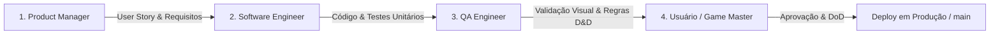

# 🐉 AGENTS.md — Padrão Ouro de Engenharia, Squad Virtual & Governança de Software

Este documento é a **Fonte Canônica de Verdade (Single Source of Truth)** para desenvolvedores, arquitetos de software e agentes de IA que atuam no repositório **Grimório do Mestre & Mentor D&D**.

---

## 🏛️ 1. Visão do Produto & Arquitetura do Sistema

O **Grimório do Mestre** é uma plataforma corporativa e assistente de IA voltada para RPG Dungeons & Dragons (D&D 5ª Edição e Revisão Oficial de 2024). A solução combina:
* **Chat Inteligente com AFC e Streaming**: Google GenAI SDK (`google-genai`), com Automatic Function Calling, streaming em tempo real (`st.write_stream`) e cascata de contingência para 99.9% de disponibilidade.
* **Motor RAG Grounded**: Recuperação semântica e estruturada sobre livros de regras oficiais indexados via PyMuPDF.
* **Auditor Multimodal de Fichas (3 Camadas)**: Visão Computacional Gemini + Extração AcroForm + Verificação Matemática Determinística em Python.
* **Gerador de Relatórios e Fichas em PDF**: Diagramação editorial profissional utilizando ReportLab Platypus.
* **Segurança e Multi-Tenancy**: Banco SQLite com RBAC (Administrador vs Jogador), hashing PBKDF2 (100.000 iterações), criptografia Fernet AES-256 e persistência de sessão tolerante a F5 via tokens assinados.

---

## 🏗️ 2. Estrutura Canônica de Diretórios

```
├── app.py                          # Entrypoint, Auth Gate, roteamento e injeção de contexto global
├── requirements.txt                # Dependências declarativas estritas
├── AGENTS.md                       # Governança de engenharia e diretrizes das personas da Squad
├── docs/
│   └── DESIGN_SYSTEM_GUIDE.md      # Guia canônico de tokens visuais, contraste e componentes
├── src/
│   ├── agent/
│   │   ├── gemini_agent.py         # Orquestrador Gemini (Streaming, AFC, Fallback Cascade)
│   │   └── prompts.py              # System prompts canônicos (Mentor, Árbitro, Regras 2024)
│   ├── auth/
│   │   ├── security.py             # Criptografia PBKDF2, AES-256 e gerador de session tokens
│   │   ├── user_manager.py         # Repositório SQLite de usuários, perfis e controle RBAC
│   │   └── auth_ui.py              # Telas de Login, Registro e Gerenciamento de Chaves de API
│   ├── rag/
│   │   ├── pdf_ingest.py           # Pipeline de ingestão, chunking e limpeza de PDFs de regras
│   │   └── vector_store.py         # Base de conhecimento e motor de busca por similaridade
│   ├── storage/
│   │   ├── chat_storage.py         # Sessões de chat particionadas por usuário
│   │   ├── audit_storage.py        # Relatórios de auditoria particionados por usuário
│   │   └── character_storage.py    # Fichas cadastradas, estatísticas e personagem ativo
│   ├── tools/
│   │   ├── character_calc.py       # Cálculos determinísticos (Mods, PB, CD de Magia, Ataques)
│   │   ├── character_importer.py   # Extração e normalização de fichas via PDF/Imagem
│   │   ├── dice.py                 # Rolador de dados estatístico (Vantagem/Desvantagem/Explosão)
│   │   ├── pdf_exporter.py         # Diagramador e exportador de PDF com ReportLab
│   │   ├── rules_lookup.py         # Dicionário de regras oficiais e condições de combate
│   │   ├── sheet_validator.py      # Pipeline de validação multimodal de 3 etapas
│   │   └── spell_lookup.py         # Repositório canônico de magias 5e/2024
│   └── ui/
│       ├── components.py           # Sidebar modular, rolador de dados, histórico contextual
│       ├── character_view.py       # Central de Heróis (lista, importador e editor completo)
│       ├── sheet_view.py           # Auditor de fichas e chat contínuo com download de PDF
│       └── styles.py               # Design System dual-theme (Grimório Sombrio vs Pergaminho Claro)
└── tests/                          # Suíte automatizada de testes unitários e de integração
```

---

## 👥 3. Squad Virtual: Papéis, Responsabilidades & Matriz RACI

Toda entrega no repositório segue um ciclo corporativo simulado por 4 personas de squad:



### 1. 📋 Product Manager (PM / Tech Lead)
* **Responsabilidade**: Define **o quê** construir e **por quê**.
* **Entregas**:
  * User Stories claras com **Critérios de Aceite (Acceptance Criteria)**.
  * Validação de impacto no produto e alinhamento ao roadmap.
  * Artefatos `/plan` estruturados antes de qualquer código complexo.

### 2. 💻 Software Engineer (Desenvolvedor Full-Stack)
* **Responsabilidade**: Implementação técnica resiliente, performática e manutenível.
* **Diretrizes de Código**:
  * **Clean Code & SOLID**: Funções puras e de responsabilidade única.
  * **Tipagem Estrita**: `typing.Optional`, `typing.Dict`, `typing.List`, `typing.Generator` em todas as assinaturas.
  * **Tratamento de Exceções**: Try/except cirúrgico, sem silenciar erros de forma oculta.
  * **Resiliência e Backoff**: Implementar retentativas em chamadas externas (`gemini-3.5-flash` ➔ `gemini-3.5-flash-lite` ➔ fallback local).

### 3. 🧪 QA Engineer (Analista de Qualidade & Testes)
* **Responsabilidade**: Garantir não-regressão, cobertura de testes e aderência visual.
* **Portões de Qualidade (Quality Gates)**:
  * **Suíte Automatizada**: 100% dos testes devem passar no Pytest (`python -m pytest`).
  * **Validação Dual-Theme**: O componente foi testado e está com contraste perfeito no **Modo Escuro** e no **Modo Claro**?
  * **Casos de Borda**: O que acontece se o arquivo for inválido, a internet oscilar ou o usuário não tiver chave de API?

### 4. 🧙‍♂️ Usuário Final (Game Master / Jogador / UAT)
* **Responsabilidade**: Avaliação de usabilidade, ergonomia e rigor com as regras de RPG.
* **Critérios de Validação**:
  * As regras citadas condizem com os livros oficiais de **D&D 5e / 2024**?
  * A experiência em mesa ao vivo é ágil e sem fricção?
  * A interface é confortável para uso prolongado em telas pequenas (mobile) e grandes (desktop)?

---

## 🌿 4. Fluxo de Trabalho Git & Branches (GitFlow)

1. **Branch `main` (Produção)**:
   * Conectada diretamente ao deploy contínuo do **Streamlit Cloud**.
   * **PROIBIDO**: Commits diretos de features não testadas na `main`.
2. **Branch `develop` (Desenvolvimento Ativo)**:
   * Branch onde todas as features, melhorias e correções são construídas e testadas.
3. **Padrão de Mensagens de Commit (Conventional Commits)**:
   * `feat: <descrição>`: Nova funcionalidade para o usuário.
   * `fix: <descrição>`: Correção de bug.
   * `docs: <descrição>`: Alterações em documentação ou guias.
   * `style: <descrição>`: Ajustes de formatação, CSS ou Design System.
   * `refactor: <descrição>`: Refatoração de código sem alterar comportamento.
   * `test: <descrição>`: Adição ou correção de testes automatizados.

---

## 🎨 5. Governança do Design System & UI

> **REGRA IMPERATIVA:** Todo componente visual DEVE obedecer ao [`docs/DESIGN_SYSTEM_GUIDE.md`](docs/DESIGN_SYSTEM_GUIDE.md).

### Regras Visuais Críticas:
1. **Contraste Dual-Theme Rigoroso**:
   * **Modo Escuro (Grimório Sombrio)**: Fundo `#0f1115`, barra lateral `#14171d`, dourado `#c99a4e`/`#e5b967`, texto `#e8e3d9`.
   * **Modo Claro (Pergaminho Arcano)**: Fundo `#f7f4ec`, barra lateral `#ece5d6`, bronze `#8a5d14`/`#6b3f02`, texto `#1c1813`.
   * **Proibido**: Texto cinza sobre fundo escuro, texto branco sobre fundo claro ou placeholders ilegíveis.
2. **Mapeamento Total de Botões**:
   * Todo estilo de botão deve cobrir: `.stButton > button`, `div[data-testid="stDownloadButton"] button`, `div[data-testid="stFormSubmitButton"] button`, `div[data-testid="stFileUploader"] button`.
3. **Chat Input**:
   * O container do `stChatInput` deve ser **estritamente Flexbox horizontal em linha única** (`flex-direction: row; align-items: center`).

---

## 🎲 6. Regras Matemáticas Canônicas de D&D (5e & 2024)

* **Modificador de Atributo**: `(Valor - 10) // 2`
* **Bônus de Proficiência (PB)**: `2 + (Nível - 1) // 4`
* **Salvaguardas**:
  * Não Proficiente: $\text{Mod} + \text{Bônus de Itens (ex: Capa de Proteção)}$
  * Proficiente: $\text{Mod} + \text{PB} + \text{Bônus de Itens}$
* **CD de Salvaguarda de Magia**: $8 + \text{PB} + \text{Modificador de Conjuração} + \text{Bônus de Itens}$
* **Bônus de Ataque com Arma**: $\text{Mod de Atributo (FOR ou DES)} + \text{PB (se proficiente)} + \text{Bônus Mágico da Arma}$
* **Checkboxes em Fichas**: Uma bolinha pintada/preenchida (●) indica proficiência. A mera anotação do modificador básico NÃO confere proficiência.

---

## 🔒 7. Segurança, Multi-Tenancy & Persistência

1. **Armazenamento Isolado por Usuário**:
   * Todos os dados de chat, auditorias e personagens ficam em `data/users/<username>/`.
2. **Criptografia em Repouso e Trânsito**:
   * Senhas com `PBKDF2` (salt único, SHA-256, 100.000 iterações).
   * Chaves Gemini do usuário criptografadas com `Fernet (AES-256)`.
3. **Persistência de Sessão (Tolerância a F5)**:
   * Geração de token de sessão assinado e criptografado (`session_token`) via query parameter, permitindo restauração automática sem exigir novo login a cada reload da aba.

---

## ✅ 8. Checklist de Definição de Pronto (Definition of Done - DoD)

Antes de considerar qualquer entrega finalizada ou propor merge para a `main`:

- [ ] **[PM]** Requisitos e critérios de aceite da User Story foram atendidos?
- [ ] **[DEV]** O código está modular, tipado, documentado e sem dead code?
- [ ] **[QA]** A suíte `python -m pytest` rodou com 100% de sucesso?
- [ ] **[QA]** O componente foi testado e validado no **Modo Escuro** e no **Modo Claro**?
- [ ] **[QA]** A interface é responsiva no Celular (< 640px) e no Desktop?
- [ ] **[UAT]** Os cálculos e citações seguem rigorosamente as regras oficiais de D&D 2024?
- [ ] **[Git]** O commit segue a convenção semântica e foi submetido na branch `develop`?
